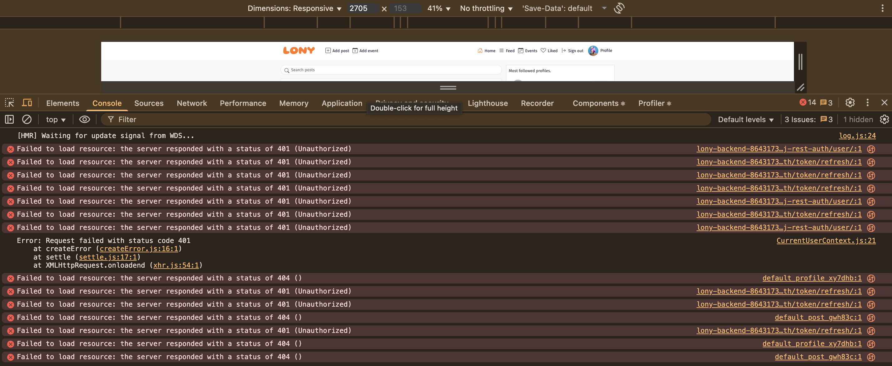

# LONY — Social platform for single parents

- **Live Frontend:** https://lonyapp-2af3ad54852f.herokuapp.com/  
- **Backend API:** https://lony-backend-86431739f0ea.herokuapp.com/  
- **Backend Repo:** https://github.com/Ivrigy/lonybackend/tree/main  
- **Testing:** [TESTING.md](https://github.com/Ivrigy/lonyapp/blob/main/TESTING.md)

---

## Project Overview

**LONY** is a safe, vibrant, and practical social platform for **single parents**. Share daily wins and hard days, post images, create and discover **events**, comment, like, and follow people who “get it”.

> Creator note: I’m a single parent; the feature set is shaped by real-life needs — fast sharing, quick discovery, and easy ways to meet up or ask for help.

---

## Table of Contents

- [Project Objectives](#project-objectives)
- [Target Audiences](#target-audiences)
- [User Stories](#user-stories)
- [Design](#design)
- [Wireframes](#wireframes)
- [Features](#features)
- [Technologies Used](#technologies-used)
- [Testing](#testing)
- [Deployment](#deployment)
- [Agile Methodology](#agile-methodology)
- [Known Issues](#known-issues)
- [Credits](#credits)
- [Acknowledgements](#acknowledgements)

---

## Project Objectives

- Deliver a **secure, responsive** community designed specifically for single parents.  
- Provide full **CRUD** for **Posts** and **Events** with intuitive UX.  
- Offer **search**, **feeds**, **likes**, **comments**, and **follow** to grow connection.  
- Keep the interface **minimal**, **gender-neutral**, and **accessible**.  
- Integrate cleanly with a **Django REST** backend.  

---

## Target Audiences

- Single parents seeking a supportive community.  
- Parents organizing or attending **events** (meetups, classes, playdates).  
- Users who want a **simple, low-friction** way to connect and share.

---

## User Stories

### Navigation & Authentication

**Navigation: Navbar**  
**User Story 1**  
*As a user, I can view a navbar from every page so that I can navigate easily between pages.*

**Routing**  
**User Story 2**  
*As a user, I can move between pages without a full reload so that navigation feels fast and seamless.*

**Sign Up**  
**User Story 3**  
*As a user, I can create an account so that I can access member features.*

**Sign In**  
**User Story 4**  
*As a user, I can sign in so that I can access features for logged-in users.*

**Logged-in Status**  
**User Story 5**  
*As a user, I can clearly tell if I’m logged in so that I know what actions are available.*

**Token Refresh (Session)**  
**User Story 6**  
*As a user, my session is maintained as long as possible so that I’m not interrupted while using the site.*

**Conditional Navbar**  
**User Story 7**  
*As a logged-out user, I only see Home / Sign in / Sign up; as a logged-in user, I see Home, Feed, Liked, Events, Add post, Add event, Profile, and Sign out.*

**Avatars**  
**User Story 8**  
*As a user, I can see avatars so that I can quickly identify people across the app.*

---

### Posts & Engagement

**Create Post**  
**User Story 9**  
*As a logged-in user, I can create a post with image and text so that I can share updates.*

**View a Post**  
**User Story 10**  
*As a user, I can open a single post to view full details, likes, and comments.*

**Like a Post**  
**User Story 11**  
*As a logged-in user, I can like/unlike posts so that I can show support.*

**Recent Content**  
**User Story 12**  
*As a user, I can browse recent posts ordered by newest first so that I’m up to date.*

**Search**  
**User Story 13**  
*As a user, I can search posts and profiles by keyword so that I quickly find relevant content.*

**Liked Content**  
**User Story 14**  
*As a logged-in user, I can view the posts I liked so that I can revisit favorites.*

**Followed Feed**  
**User Story 15**  
*As a logged-in user, I can view a feed filtered to people I follow so that my home experience feels personal.*

**Infinite Scroll**  
**User Story 16**  
*As a user, I can keep scrolling to automatically load more items so that I don’t have to click pagination links.*

**Comments**  
**User Story 19**  
*As a logged-in user, I can add comments to a post so that I can join the conversation.*  
**User Story 21**  
*As a user, I can read comments in order so that I can follow the discussion.*  
**User Story 22**  
*As the owner of a comment, I can delete my comment so that I can remove it from the app.*  
**User Story 23**  
*As the owner of a comment, I can edit my comment so that I can fix or update it.*

---

### Events

**Create Event**  
**User Story (Events) A**  
*As a logged-in user, I can create an event with image, title, date/time, location, and description so that I can organize or promote meetups.*

**Browse & Search Events**  
**User Story (Events) B**  
*As a user, I can browse recent events and search by keyword so that I can find activities that matter to me.*

**Event Engagement**  
**User Story (Events) C**  
*As a logged-in user, I can like and comment on events so that I can interact, ask questions, and show interest.*

---

### Profiles & Following

**Profile View**  
**User Story 24**  
*As a user, I can view a profile with stats (posts, followers, following, events) and bio so that I can learn about the person.*

**Most Followed**  
**User Story 25**  
*As a user, I can see a list of the most-followed profiles so that I can discover people to follow.*

**Follow/Unfollow**  
**User Story 27**  
*As a logged-in user, I can follow or unfollow users so that my feed reflects my interests.*

**All User Posts**  
**User Story 28**  
*As a user, I can view all posts by a specific user so that I can catch up on their content.*

---

## Design

- **Style:** minimalistic layout with **bright**, gender-neutral accents.  
- **Primary accents:** `#9a8cf0` (interactive elements) and `#FF781F` (brand/logo).  
- **Typography:** clean, legible system fonts; sizing and spacing optimized for readability.  
- **Framework:** React + React-Bootstrap with custom CSS modules.

---

## Wireframes (Low-fi)

| Posts Feed | Events Feed | Sign up / Sign in |
| --- | --- | --- |
|  |  |  |

---

## Features

### 1) Authentication Flow

- **Sign up** and **Sign in** with clear validation and messages.  
- Redirects after login; session persistence with refresh tokens.

**Screens**  
  

---

### 2) Global Navigation

- Responsive **Navbar** visible on all pages.  
- Dynamic links: Home, Feed, Events, Liked, Add post, Add event, Profile (with avatar), Sign out.

**Screen**  

---

### 3) Posts

- Create posts with image and caption.  
- **Infinite scroll** on feeds.  
- **Likes & comments** inline; counts update without reload.  
- **Search** posts by keyword.  
- **Liked** page to revisit favorites.

**Screens**  
  
  

---

### 4) Events

- Create events with **date & time**, **location**, **image**, **description**.  
- Events list integrates with search and infinite scroll.  
- Likes and comments on events.

**Screens**  
  

---

### 5) Profiles & Discovery

- Profile with avatar, bio, and **stats**: posts, followers, following, events.  
- **Most followed profiles** module; follow/unfollow inline.

**Screen**  

---

## Technologies Used

**Languages & Frameworks:** React (JSX), React-Bootstrap, CSS Modules  
**Backend:** Django REST (separate repo/app)  
**Build & Deploy:** CRA build, Heroku (Procfile + static serving)  
**Images:** Cloudinary-hosted assets (where applicable)

---

## Testing

A detailed test log with steps and outcomes is in **[TESTING.md](https://github.com/Ivrigy/lonyapp/blob/main/TESTING.md)**.

## Deployment

**Frontend (Heroku) — what was done (in plain words):**
1. Built the production bundle with Create React App.
2. Added a **Procfile** that tells Heroku to serve the compiled `build` folder with a tiny static server.
3. Added a small **prebuild** step so Heroku installs that static server before building.
4. Connected the Heroku app to the GitHub repo and deployed the `main` branch (manual or automatic deploys both work).
5. Pointed the frontend’s Axios base URL to the **live backend API**.
6. Verified client-side routing and assets load as expected.

If you replicate: create a Heroku app, add a Procfile for static serving, add the brief prebuild install, connect GitHub, deploy `main`, and confirm API base URLs target production.

---

## Agile Methodology

- Managed with **MoSCoW** prioritization and iterative delivery.  
- **GitHub Projects** board for user stories and tracking:  
  https://github.com/users/Ivrigy/projects/4  
- Delivered in vertical slices: UI → API integration → tests → polish.

---

## Known Issues

- **Token refresh noise / 401s** in console when logged out or when refresh expires mid-session.  
  
- **Image placeholder 404s** for some default assets on a few routes.  
- **Bootstrap/image responsiveness tweaks** needed in a couple of card layouts.  
- **Time formatting** for events needs refinement for all locales.

(See **TESTING.md** for screenshots and the improvement roadmap.)

---

## Credits

- **Logo & palette:** in-house; accent colors derived using Tailwind CSS color tools.  
- **React-Bootstrap** for base components; custom CSS for layout and brand.  
- **Cloudinary** for image hosting where used.

---

## Acknowledgements

Deep gratitude to God, my child, my mom, my dad, friends, and my nervous system for surviving this project despite **ADHD** and **dyslexia**. Thanks to the **Code Institute** materials (esp. “Moments” walkthrough) and to the CI assessor for a fair and a human review without prejudice.
