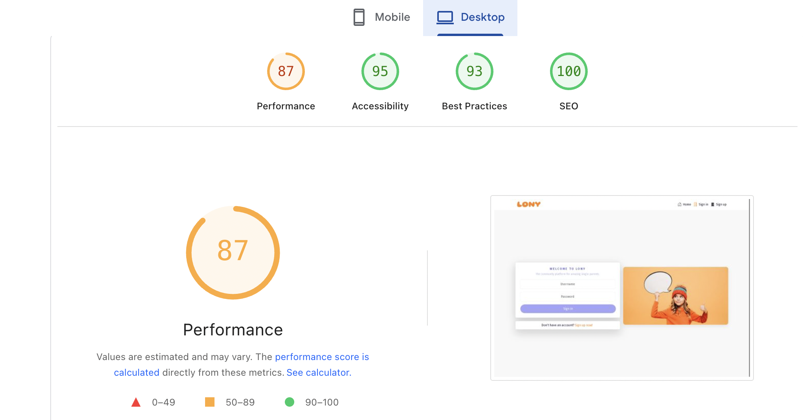
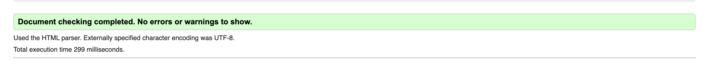
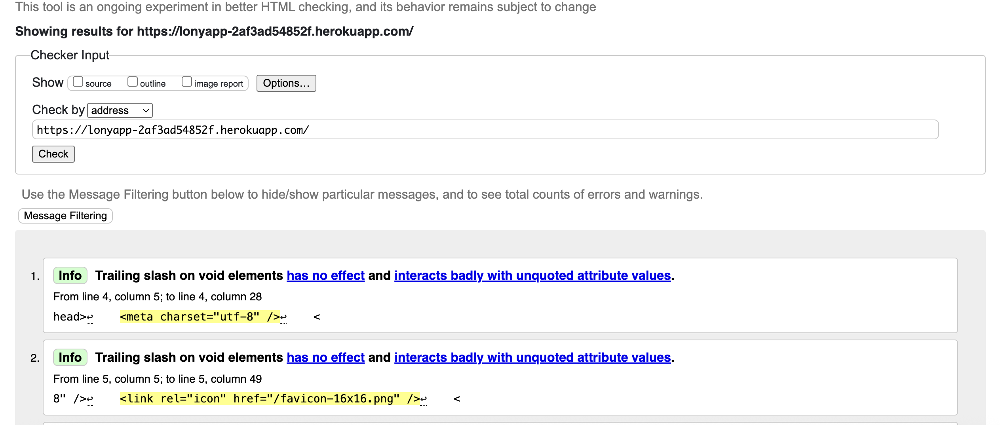
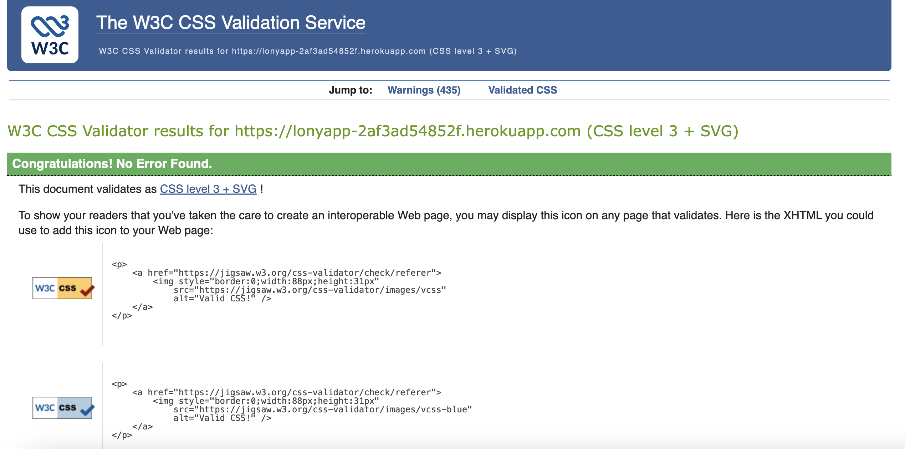
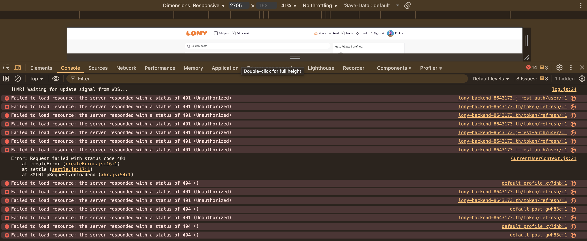

# TESTING

- [Lighthouse Testing](#lighthouse-testing)
- [Validator Testing](#validator-testing)
- [Responsiveness Testing](#responsiveness-testing)
- [Manual Testing](#manual-testing)
- [Fixed Bugs](#fixed-bugs)
- [Unfixed Bugs / Known Limitations](#unfixed-bugs--known-limitations)

---

## Lighthouse Testing

Google Lighthouse (Chrome DevTools) was used to test **Performance**, **Accessibility**, **Best Practices**, and **SEO**.

- **Sign in page (Desktop)** — Performance: **87**, Accessibility: **95**, Best Practices: **93**, SEO: **100**

_Notes_: Performance varies per run due to third-party requests and image sizes. After we constrained the big event/post images, performance improved.

---

## Validator Testing

### HTML (W3C Nu HTML Checker)

The deployed URL passed the HTML checker with **no errors** (only two **info** notes about trailing slashes on void elements, which are acceptable for React’s generated markup).

### CSS (W3C CSS Validator)

The deployed URL passed with **no errors**.

### ESLint (static code analysis)

The **src** folder was linted using Create React App’s ESLint config — **no blocking errors** were reported during CI/test runs.

I ran npm audit and observed vulnerabilities primarily in dev-dependencies of react-scripts (webpack dev server, jest, workbox). These tools are not included in the production build. I avoided npm audit fix --force to prevent breaking changes (notably react-scripts@5 and axios@1). We will revisit these upgrades after the assessment window. The production bundle is unaffected.

Also as part of unit tests, React Testing Library suites passed (NavBar + App smoke tests):

---

## Responsiveness Testing

Tested manually in Chrome DevTools across common widths. The app uses Bootstrap 5 grid + utility classes.

> **Devices / widths checked**: 320, 375, 414, 768, 1024, 1366, 1440, 1920.

| **TEST** | **ACTION** | **EXPECTATION** | **RESULT** |
|---|---|---|---|
| Navbar | Shrink below 992px | Collapses to burger; links stack | ✅ |
| Sign in / Sign up | 320 → 1920 | Card centers; illustration wraps under on mobile | ✅ |
| Home (Posts feed) | 320 → 1920 | Search bar stays visible; posts fill width | ✅ |
| Events list | 320 → 1920 | Cards resize; date/location remain readable | ✅ |
| Single Event page | 320 → 1920 | Large image constrained (max-height) | ✅ |
| Profile page | 320 → 1920 | Tabs switch Posts/Events, counts visible | ✅ |
| Liked page | 320 → 1920 | Cards/grid responsive | ✅ |
| Popular Profiles (sidebar) | ≥992px | Shows right column | ✅ |
| Popular Profiles (mobile) | <992px | Renders above content | ✅ |

_Notes_: When **not logged in**, the token refresh protection prevents some authenticated feeds from loading; this is expected and documented below.

---

## Manual Testing

### User Registration & Login

| **Test** | **Action** | **Expected Outcome** | **Result** |
|---|---|---|---|
| Open Sign up | Click **Sign up** | Registration form displays | ✅ |
| Create account | Enter username + password + confirm | Redirect to Sign in | ✅ |
| Duplicate username | Use taken username | Error message shown | ✅ |
| Weak/mismatch password | Enter weak or mismatching | Error message shown | ✅ |
| Sign in | Valid credentials | Redirect to **Home** (working redirect) | ✅ |
| Sign in invalid | Wrong credentials | Error message shown | ✅ |

### Navigation (based on auth)

| **Test** | **Action** | **Expected** | **Result** |
|---|---|---|---|
| Logged-out navbar | Open site logged out | Shows: Home, Sign in, Sign up | ✅ |
| Logged-in navbar | Sign in | Shows: Add post, Add event, Home, Feed, Events, Liked, Sign out, Profile avatar | ✅ |
| Sign out | Click **Sign out** | User cleared; redirected to Sign in; cookie cleared | ✅ |

### Posts

| **Test** | **Action** | **Expected** | **Result** |
|---|---|---|---|
| List & search | Home → search | Matching posts returned | ✅ |
| View single | Click post | Details page renders; comments area | ✅ |
| Like/unlike | Click heart | Toggles like; count updates; owner cannot like own post | ✅ |
| Create | Add post | New post appears on Home/Feed | ✅ |
| Edit/Delete (owner) | More menu | Updates persist / item removed | ✅ |

### Events

| **Test** | **Action** | **Expected** | **Result** |
|---|---|---|---|
| List | Nav → **Events** | Event cards render (title, date, location) | ✅ |
| Like/unlike | Click heart | Toggles like; count updates | ✅ |
| Legacy likes | Like older events | Previously failing 400s fixed; now works | ✅ |
| Image size | Open single event | Image constrained to avoid overflow | ✅ |

### Profile

| **Test** | **Action** | **Expected** | **Result** |
|---|---|---|---|
| Open profile | Click avatar/Profile | Profile header, counts, tabs (Posts/Events) | ✅ |
| Follow/unfollow | Click follow/unfollow | Counts update; button state updates | ✅ |
| Edit profile | Dropdown actions | Image/bio/username/password flows | ✅ (where enabled) |

### 404

| **Test** | **Action** | **Expected** | **Result** |
|---|---|---|---|
| Invalid route | Visit `/nope` | NotFound Asset with message; navbar links work | ✅ |

---

## Fixed Bugs

### 1 Old events could not be liked (400 Bad Request)

- **Cause**: API payload mismatch and stale like ids in legacy items.
- **Fix**: Standardized like handlers (POST/DELETE) and ensured UI “bump” logic syncs counts + `like_id`.  
- **Result**: Likes work on both new and old events.

### 2 Sign in did not redirect to Home

- **Cause**: History push logic not using the `location.state?.from` fallback.
- **Fix**: In `SignInForm`, after `setCurrentUser(data.user)`, call `history.replace(location.state?.from?.pathname || "/")`.  
- **Result**: Redirect works consistently after sign in.

### 3 Single event image too large

- **Cause**: Unconstrained media on detail view.
- **Fix**: CSS added to cap image height / object-fit, preventing overflow.  
- **Result**: Detail pages look balanced on mobile and desktop.

### 4 PopularProfiles / ProfilePage follow buttons not updating

- **Cause**: Missing optimistic helpers + state sync between lists and detail.
- **Fix**: Reused `followHelper` / `unfollowHelper` and lifted state updates.  
- **Result**: Counts and buttons update instantly.

---

## Unfixed Bugs / Known Limitations

### A Token refresh noise for logged-out users

- **What you’ll see**: Intermittent `401 (Unauthorized)` for `dj-rest-auth/user/` and `token/refresh/` when browsing logged-out.
- **Why**: Interceptors attempt a refresh even when no session exists (browser feedback from the API).
- **Planned**: Implement the “timestamp-gate” (store refresh token `exp` in `localStorage` and only attempt refresh when present).  
  Screenshot (typical console noise):

### B 404s for default images

- **What**: `404` on `default_profile_bbo1dj` / `default_post_gwh83c` when Cloudinary placeholder isn’t present.
- **Workaround**: Local fallback image; planned: ensure placeholders exist or swap to an internal asset.

### C Minor SVG warning

- **What**: `viewBox: Expected number, "0 0 100% 4"` from a third-party icon.  
- **Planned**: Replace icon or correct attribute.

### D UI polish still in progress

- Time format consistency, success toasts/alerts, and a dedicated info page for non-logged-in users are on the roadmap.

---

### Post-Submission Fix Plan (Roadmap)
This section outlines what I’ll improve after submission. It’s prioritized, measurable, and mapped to known issues from testing.

0) Definitions & Success Meter

Target Lighthouse (Desktop/Mobile): Perf ≥ 90, Access ≥ 95, Best Practices ≥ 95, SEO = 100.

Console hygiene: No repeating errors during normal navigation. Expected/one-off 401s on mount (logged-out) are acceptable.

Test coverage (frontend): Unit + integration for NavBar auth states, like/unlike, posting flows.

Responsiveness: 320 → 1920 px; no horizontal scrollbars.
2) Short-Term Improvements (Week 1)

Token refresh noise reduction (unauth users)

What: Attempt refresh only if a refresh timestamp exists.

How: Add setTokenTimestamp, shouldRefreshToken, removeTokenTimestamp in utils.js.

Call setTokenTimestamp(data) on successful sign-in.

Wrap axios interceptors with if (shouldRefreshToken()).

Call removeTokenTimestamp() on 401 refresh failure and on logout.

Test: Logged-out navigation produces only initial 401 triplet; no repeated refresh attempts when scrolling feed.

Time formatting consistency

What: Consistent, readable dates across Posts/Events/Profile.

How: Use toLocaleString('en-GB', { day:'2-digit', month:'short', year:'numeric', hour:'2-digit', minute:'2-digit' }) via small util (e.g., formatDate.ts/js).

Test: Dates match pattern everywhere and respect timezone.

Navbar imports optimization

What: Tree-shake bootstrap imports.

How: import Navbar from 'react-bootstrap/Navbar' etc. across components.

Measure: Slight bundle drop; faster build.

Refetch on auth change (Feed/Posts)

What: Refresh feeds when user logs in/out.

How: const currentUser = useCurrentUser(); and add to deps array.

Test: Log out → liked/feed adapt immediately.

Notifications

What: Success/error toasts for actions.

How: Plug react-toastify (or Bootstrap Alerts minimally).

Test: Like/unlike, create/edit/delete show feedback.

3) Medium-Term (Week 2–3)

Accessibility pass

What: Landmarks, form labels, focus states, aria-labels for icon buttons (like/unlike, edit).

Test: Lighthouse Access ≥ 95; keyboard-only navigation ok.

Performance

What:

Lazy-load heavy routes (Events detail, Profile).

Add loading="lazy" to feed thumbnails.

Compress hero/illustrations.

Measure: Lighthouse Perf ≥ 90 on signin/home.

Testing

What:

Unit: Avatar, MoreDropdown, Event like/unlike bump logic.

Integration: NavBar switches (logged in/out), PostsPage search debounce.

Mock network via msw handlers.

Run: npm test + npx eslint src --ext .js,.jsx.

Error reporting

What: Centralize API errors; optional Sentry hook (env-guarded).

Test: Controlled logs; user-friendly messages.

4) Backend/Infra Alignment (Parallel)

CORS & Cookies: Confirm CSRF/SESSION/dj-rest-auth cookie flags for production (Secure, SameSite).

Defaults endpoint: Provide guaranteed default profile/post images to stop 404s.

Rate-limit likes: Prevent accidental spam clicks server-side in addition to front-end busy guard.

5) UX Polish

Public info page for logged-out users: Explain features with CTA buttons (Sign in / Explore).

Consistent UI spacing & typography: Normalize padding/line-height across cards and forms.

Profile tabs (Posts/Events): Maintain active tab in URL (?tab=events) so refresh keeps context.

6) Known Issues & Acceptance Criteria

Token refresh flakiness

Done when: Only initial 401s appear for logged-out users; no periodic refresh attempts until login; logout clears timestamp.

Image responsiveness

Done when: No image overflows on 320–1920 px; event detail image capped to viewport height; feed images lazy-load.

Time format

Done when: All dates use the same GB short pattern.

Console cleanliness

Done when: No repeating 401/404 loops, no SVG warnings, no unused-var warnings in tests.

7) Nice-to-Haves

CI lint/test gate: GitHub Actions to run eslint and tests on PRs.

Pre-commit hooks: Husky + lint-staged to keep diffs clean.

E2E smoke: Cypress for sign-in, like, and create-post happy paths.

8) Retesting Checklist (to close the loop)

Run Lighthouse (mobile/desktop) on Home, Sign in, Event detail.

Validate HTML & CSS again.

npx eslint src --ext .js,.jsx → 0 errors/warnings.

Jest/MSW tests → all green.

Manual pass on 320/375/768/1024/1440/1920 px.

Console: clear → navigate feed → open event → like/unlike → logout → no recurring errors.